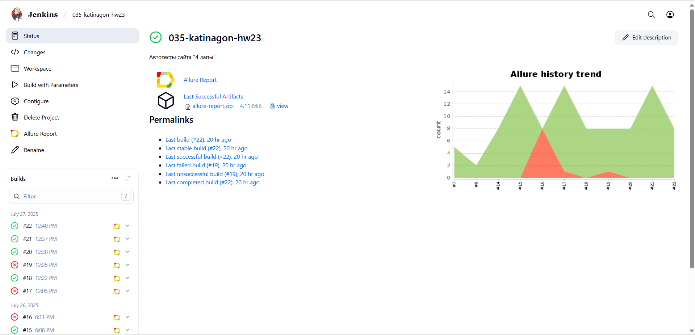
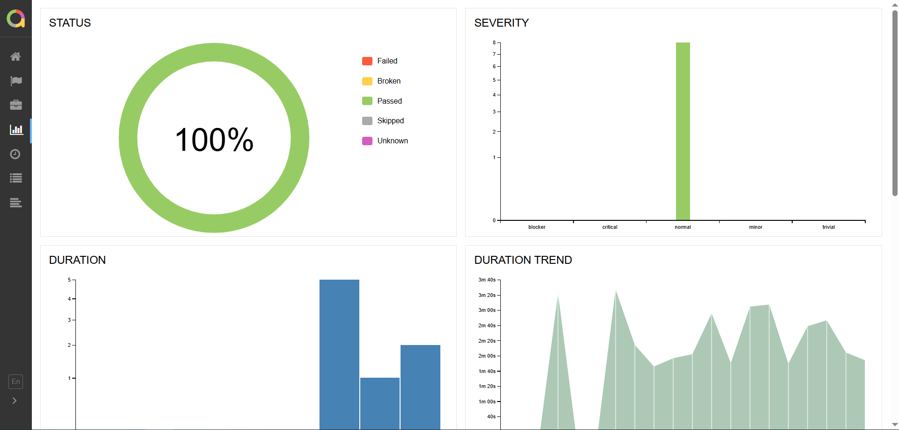

# Автотесты для сайта CrowdTesting
<p align="center">

</p>

[Сайт CrowdTesting](https://crowdtesting.ru/)

## :pushpin: Содержание:

- [Технологии и инструменты](#computer-технологии-и-инструменты)
- [Команды для запуска из терминала](#arrow_forward-команды-для-запуска-из-терминала)
- [Сборка в Jenkins](#-сборка-в-jenkins)
- [Пример Allure-отчета](#-пример-allure-отчета)
- [Уведомления в Telegram с использованием бота](#-уведомления-в-telegram-с-использованием-бота)
- [Видео примера запуска тестов в Selenoid](clapper-видео-примера-запуска-тестов-в-selenoid)

## :computer: Технологии и инструменты

<p align="center">
<a href="https://www.jetbrains.com/idea/"></a>
<a href="https://www.java.com/"></a>
<a href="https://selenide.org/"></a>
<a href="https://aerokube.com/selenoid/"></a>
<a href="https://github.com/allure-framework/allure2"></a>
<a href="https://gradle.org/"></a>
<a href="https://junit.org/junit5/"></a>
<a href="https://github.com/"></a>
<a href="https://www.jenkins.io/"></a>
<a href="https://web.telegram.org/"></a>
</p>

- Автотесты написаны на языке <code>Java</code> с использованием фреймворков <code>Selenide</code>, <code>JUnit 5</code>
- Сборщик проекта - <code>Gradle</code> 
- При прогоне тестов браузер запускается в<code> Selenoid</code>
- Для удаленного запуска реализована джоба в <code>Jenkins</code> с формированием Allure-отчета и отправкой результатов в <code>Telegram</code> при помощи бота

## :arrow_forward: Команды для запуска из терминала

### *Локальный запуск:*
```
gradle clean open_pages
```
### *Удалённый запуск через Jenkins:*
```
clean
${TASK}
-Dselenide.pageLoadStrategy=eager
"-Dselenoid.url=${SELENOID_URL}"
-Dselenoid.login=${SELENOID_LOGIN}
-Dselenoid.password=${SELENOID_PASSWORD}
"-Dbrowser=${BROWSER}"
"-Dbrowser.version=${BROWSER_VERSION}"
"-Dbrowser.size=${BROWSER_SIZE}"
```
### *Параметры сборки:*

* <code>TASK</code> – задача для запуска
* <code>BROWSER_VERSION</code> - браузер, в котором будут выполняться тесты. По-умолчанию - <code>chrome</code>.
* <code>BROWSER_VERSION</code> – версия браузера, в которой будут выполняться тесты. По-умолчанию - <code>128.0</code>.
* <code>BROWSER_SIZE</code> – размер окна браузера, в котором будут выполняться тесты. По-умолчанию - <code>1920x1080</code>.

##  <a href="https://jenkins.autotests.cloud/job/035-katinagon-hw14/">Сборка в Jenkins</a>
<p align="center">

</p>

##  <a href="https://jenkins.autotests.cloud/job/035-katinagon-hw14/25/allure/">Пример Allure-отчета</a>
### *Основная страница отчёта*

<p align="center">

</p>

### *Тест-кейсы*

<p align="center">

</p>

### *Графики*

<p align="center">

</p>

##  Уведомления в Telegram с использованием бота

После завершения сборки бот в <code>Telegram</code> автоматически обрабатывает и отправляет сообщение с результатом.

<p align="center">

</p>

## :clapper: Видео примера запуска тестов в Selenoid

К каждому тесту в отчете прилагается видео прогона.
<p align="center">
  
</p>

